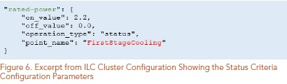
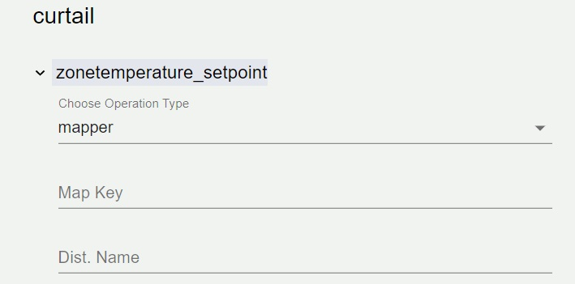
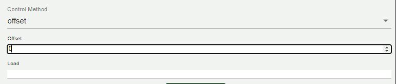

.. test documentation master file, created by
   sphinx-quickstart on Tue Jun 16 09:50:20 2020.
   You can adapt this file completely to your liking, but it should at least
   contain the root `toctree` directive.

.. toctree:: 
   :maxdepth: 3

###############################
ILC Web application: User guide
###############################

************
Introduction
************

The ILC configuration tool is used to create an ILC configuration store for use in VOLTTRON. The configuration store content being created will be shown in the viewing pane on the right side of the application. 

*****************************
ILC APPLICATION CONFIGURATION
*****************************

The ILC application behavior is controlled through these
configuration Pages:

1. The *main configuration* page
2. The *device/criteria configuration* page
3. The *pairwise configuration* page
4. The *criteria configuration* page
5. The *control configuration* page

The following sections describe what each configuration file
controls and the parameters defined within these configuration
files.
      

Importing the Master Driver Configuration Store
***********************************************
At the initial homepage, the user will be prompted to upload the **Master Driver Configuration Store** file. Values within the Master Driver Configuration Store will be parsed to provide options for Campus, Buidling, Device and Points throughout the application.

Once the user has selected the Master Driver Configuration Store, this homepage will not appear again. However, if the user needs to upload a different Master Driver Configuration Store at any point, this option can be accessed via the Menu icon in the top left of the application.

.. Warning:: Uploading a new Master Driver Configuration Store will remove all current data in the application.

.. image:: _images/import_Master_driver.jpg

Main Configuration
************************  

The main configuration store contains building level configuration
parameters.

The following list describes each of the configuration parameters in
the main configuration store. 

 .. image:: _images/main_Config_master.jpg

This list will go over each of the input options located in the main configuration page:
-  Campus
-  Building
-  Power_meter
-  Device
-  Agent ID
-  Demand Limit
-  Control Time 
-  Curtailment Confirm
-  Curtailment Break
-  Average Building Power Window

**Campus**
   The campus name as published by the VOLTTRON
   platform.driver service.

**Building**
   The building name as published by the VOLTTRON
   platform.driver service.

  
**Power Meter**
   contains information to identify the power meter data published by the platform.driver. Expand the Power Meter dropdown to select the device, point, and define the Demand Formula using the calculator interface

   .. image:: _images/power_Meter.jpg
  
**Agent ID**
   The ILC instance (running application) name on the VOLTTRON platform.
   
   .. image:: _images/agent_Id.jpg
  
**Demand Limit**
   The ILC application manages devices (curtail) in an attempt to keep the average whole building power below this kilowatt value. The average time is determined by the average_building_power_window parameter.

   Demand limit will take an input as a float.

.. Note:: ILC will manage controllable loads to maintain building demand at this value. 

**Control Time**
   The amount of time (minutes) the ILC application holds curtailment of devices once the building goal is met. During this period if the average WholeBuildingPower value increases above the goal the timer resets and the ILC application will attempt to curtail additional available devices. If all devices have been curtailed and the WholeBuildingPower is still above the goal the timer is not reset.

.. Note:: After ILC control brings the building demand to the demand
   target, I:C will hold control of devices for this amount of time, then the ILC will begin 
   to release devices. 

**Curtailment Confirm**
   Delay time (minutes) after curtailment actions to confirm that building demand goal has been met. If the building goal has not been met, additional curtailment action(s) will be taken if possible.

**Curtailment Break**
   The time (minutes) after the completion of curtailment actions where no further curtailment actions are taken. Completion of curtailment actions happens after the curtailment_time timer elapses (i.e., the average WholeBuildingPower goals was met and maintained for the curtailment_time or all devices were curtailed and the curtailment_time timer elapsed).

**Average Building Power Window**
   The average building power is calculated using a moving window. This parameter configures the length (minutes) of that window.

**Stagger Release/ Off Time**
   The Stagger Release algorithm is in testing to alleviate the potential rebound effect caused by returning devices to normal operations.

   Both buttons can be checked or unchecked: 

Calculator
**********

The calculator is a tool that is used throughout the configuration tool to create an operation string and arrays of operation arguments. There are variations on options based upon locations within the application.

.. image:: _images/calculator.jpg

The calculator pad buttons when pressed will populate the **operation** string above. Once the *save operation* button is pressed, the values in the ILC Configuration Store will be updated.

**Operation**
   An *operation* is a string representation of a mathematical formula. 

.. image:: _images/operation.jpg

.. Note:: You cannot directly enter characters into the operation string, it has to be populated by using the calculator pad buttons.

**Operation Argument**
   *Operation Arguments* are points derived from the selected device. To enter an operation argument into the operation, select an operation argument from the dropdown input and press the *+ADD* button to the right of the dropdown input.

**Clear formula**
   The *Clear formula* button on the calculator will clear the formula currently in use.

.. image:: _images/calculator_Clear.jpg

**Save Operation**
   The *Save Operation* button will save the formula that is currently being used to the ILC Configuration Store. If the Operation is not saved, the ILC Configuration Store will not be updated.

 
Clusters
********
A *cluster* consists of a group of devices with the same criterion. To add a cluster, click on the *+Add Cluster* button in the Left Panel. Creating a cluster will populate a dropdown within the left side panel where the user will gain access to the Pairwise Configuration, Criteria Configuration, Control configuration.

.. image:: _images/add_Cluster.jpg

**Cluster Name**
   The referenced name of the cluster. 

**Cluster Type**
   The system type of the cluster. 

**Cluster Priority**
   Weighting factor assigned to this cluster. The sum of these weighting factors for all clusters will equal 1.0.

.. image:: _images/cluster_Example.jpg

.. Note:: The cluster priority section needs to be set to 1 if only one cluster is present. When there are multiple clusters, existing cluster priorities can be updated by changing the priority value for the existing cluster and pressing the *Save New Priority* button.

.. image:: _images/cluster_Priority.jpg

**Cluster Editing**
   The cluster name, type and priority can be revised after the creation of the cluster by navigating to the *Edit Clusters* page, a link to which is found in the left side panel. 

   .. image:: _images/cluster_Edit_icon.jpg

   When chosen, the current clusters that are currently created will appear
   inside of the center of the screen.

   .. image:: _images/cluster_Edit.jpg

   Editing the clusters allows you to change the *name* of the cluster, the *cluster type*, and 
   the *cluster priority. 

Pairwise Configuration
**********************
In the left side panel tree, there will be a Cluster dropdown created upon adding a new cluster. After expanding a Cluster tree, the **Pairwise Criteria** page can be reached.

.. image:: _images/cluster_Options.JPG

**Criteria**
The creation, deletion and ordering of cluster criteria is handled here. Adding a criteria is done by pressing the *+Add Criteria** button. Deletion of a cluster criteria is done by pressing the *X* on the right side of the criteria. Order of the criteria is changed by dragging and dropping criteria.  

.. image:: _images/custom_Cluster.JPG
   
Expanding the criteria dropdowns below will expose sliding scales to set comparison curtail values. Inside each dropdown the **Red** line indicates a lesser curtail value, which is the reciprocal of the value shown i.e. 2 will be 1/2 and 3 will be 1/3. The **Blue** line a greater curtail value.  

.. image:: _images/zonetemperature_Setpoint.jpg

.. Warning:: When reordering, adding or deleting criteria, criteria curtail values will reset back to the default value of 1. 

Criteria Configuration
**********************

Criteria configuration is the second dropdown inside the created Cluster. It will be listed as shown: 

.. image:: _images/criteria_Configuration_Sidebar.jpg

*Criteria configuration* takes in stored values from *pairwise configuration* and reflects the device topic criteria and their order. 
once this option is selected, you will see an button appear in the center of the application: 
There are two drop down options once *Criteria Configuration* is chosen.

The first one will be *Mapper Editor*.  
Inside Mapper Editor there are items set inside by default. These items
are labeled as *Private office*, *Office*, *Conference Room*, *Lobby*, and *Restroom*.

These items will be inside **Mapper Editor** by default, but can be modified 
or removed completely. 

when the *dist name* icon is selected, this will give an option to add a room name
and a value for that room (dist val). Once these entries are entered, they will appear along with 
the other values listed. 

Expand the device topic to view criteria configuration options:

.. image:: _images/criteria_Configuration_Ex.JPG

.. Note:: When the *remove map key* icon is selected, the mapper Editor
      in use will be removed. 

If a new Mapper is needed, there is an icon below *Add Dist Name* called 
*Add Map Key*. 

This button will allow for an entire new Mapper Editor to be added. 

**Device Topics**

Expand the device topic to view criteria configuration options:

.. image:: _images/criteria_Configuration_Ex.JPG
     
Once an option within the drop down is chosen, there will be an input to 
*choose operation type*. The different operations types are  
*formula*, *status*, *mapper*, *constant*, and *history*. 

Any number of relevant criteria can be used to prioritize loads for
curtailment to manage consumption (e.g., electricity or natural gas).
The ILC application supports five types of configurable criteria
which include the following:

.. image:: _images/operation_Type.JPG

**Formula**

*Formula* allows a user to declare mathematical formulas that are evaluated using current device measurements(data from the device are published by the VOLTTRON platform.driver service). 

.. image:: _images/formula.jpg

-  *operation* : String representation of a mathematical formula.
   This mathematical formula is evaluated to return a numeric value.

-  *operation_args* : List of point names from the device
used to evaluate the mathematical formula in the operation
parameter. The values associated with each point are updated
when new device data are published by the platform.driver.

**Status**

The status criterion reads a point (Boolean or enumeration) on the device and returns either an on_value or an off_value depending on whether the current status of the point is True (enumeration value of 1) or False(enumeration value of 0), respectively. The following list contains the status criterion configuration parameters:

-  *point_name* : The point on the device that is evaluated.
   This device point should be a Boolean or an enumeration with a
   value of 0 or 1.

-  *on_value* : The numeric value returned by the criterion if the
   point on the device indicates a True or enumeration value of 1.

-  *off_value* : The numeric value returned by the criterion if the
   point on the device indicates a False or enumeration value of 0.
   Figure 6 shows an example of a status criterion configured for
   a heat pump. The criterion name, rated-power, should match
   the name for the same criterion used in the pairwise comparison
   configuration file.

**Mapper**
   The mapper criterion allows a user to categorize loads and assign values to the categories. For example, room type can be used to set the importance of the rooms (heating or cooling of the room constitutes the load) for curtailment of power consumption. Rooms assigned higher numerical values are regarded as less important (more likely to be curtailed first) than rooms assigned lower numerical values. Users set their own priority depending on the importance of the room (1: most important and 7: less important). Table 2 shows an example of AHP priority based on room type.

.. image:: _images/table_2.JPG
  
**Mapper Editor**
Shown at the top of the *Criteria Configuration Page*. 

The following list contains the mapper criterion configuration
parameters:
-  *Map Key* – The category assigned to the device.
   Figure 7 shows an example of a mapper criterion configured for
   a heat pump. The criterion name, room-type, should match the
   name for the same criterion used in the pairwise comparison
   configuration file.
-  *dict_name* : The dictionary name in the main ILC configuration
   file that contains the key (category) and value assigned to that
   category.

.. image:: _images/figure_7.JPG
 

**Constant**

.. image:: _images/constant.JPG
   
The constant criterion returns a constant value for inclusion in the AHP. The following list contains the constant criterion configuration parameters:

-  value : The value returned by this criterion for inclusion in the
   AHP.

Figure 8 shows a constant criterion example, configured for a heat
pump. The criterion name, stage, will match the name for the
same criterion used in the pairwise comparison configuration file.

.. image:: _images/figure_8.JPG
    
   

**History**

.. image:: _images/history.JPG
  
   
The history criterion evaluates the rate of change of a point on the
device to return a numeric value. The following list contains the
history criterion configuration parameters:

-  Point Name : The point on the device that is evaluated.

-  Comparison Type : This configuration parameter can be
   configured to be direct or inverse. A direct comparison returns
   the value of the point at the current time minus the value of the
   point at some time in the past (configured as previous_time).
   An inverse comparison returns unity divided by the value of the
   point at the current time minus the value of the point at some
   time in the past (configured as previous_time).

-  Previous Time : Time in minutes in the past to compare to
   current value of the point on the device.

-  Minimum:  

-  Maximum:
   
The figure below shows an example of a history criterion configured for
a heat pump. The criterion name, historical-comparison,
should match the name for the same criterion used in the pairwise
comparison configuration file.

.. image:: _images/figure_9.JPG
   
   

Control Configuration
*********************
The Control Configuration page can be accessed under the Cluster dropdown menu in the left side bar.  

.. image:: _images/control_Config_Sidebar.JPG
   
   
The once navigated to the page, the list of device topics determined in the criteria configuration will be shown: 

.. image:: _images/control_Configuration_nodrop.JPG
   
   
Upon expansion of the device topic dropdown, the Curtail Device Status operation and Curtailment Settings forms will be available. 

   
**Curtail Device Status**
   This section allows the user to enter in an operation equation using the Calculator component. 

.. Note:: Please refer to the *Calculator* Section of this user guide for instructions on calculator use. 
   

**Curtailment Setting**
   Under Curtailment Setting, the user will select a Point

   .. Note:: The point on the device (i.e., HP1) that is commanded to
      achieve the load reduction.

There will be a dropdown list that will show as you select point. 
 

**Control Method** : The options for Control Methods are offset, value and equation.

- Offset: If offset parameter is chosen, then the current value of the point on the device plus the offset is commanded to the point on the device to achieve the desired load reduction.

 
- Value : *The value the point is commanded to, in order to achieve the load reduction.

.. image:: _images/value_Config.jpg

- Equation : equation allows operation string creation from the calculator. Reference the *Calculator* section for further instructions on calculator usage.

**Load** : 
   The last item in the curtailment settings section is the load determination. The type of load values are Equation, which will prompt for values using the Calculator feature, and Float, enabling the user to enter a numerical float value. Toggle between the options by pressing the corresponding radio button. 

**Augment** : 
   At the bottom of the device topic section there is a button to *ADD AUGMENT*. By default, this will copy values currently entered for the curtail section into a duplicate Augment section for customization. The Augment section can be removed at any time by pressing the *REMOVE AUGMENT* button.

Settings
--------

**Dark Mode** : There is an option for this document to be used in dark mode. Click the *Contrast* icon on the top right corner of the page to toggle this option. 

.. image:: _images/dark_Mode.jpg

