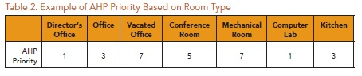
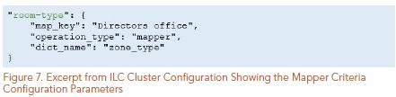
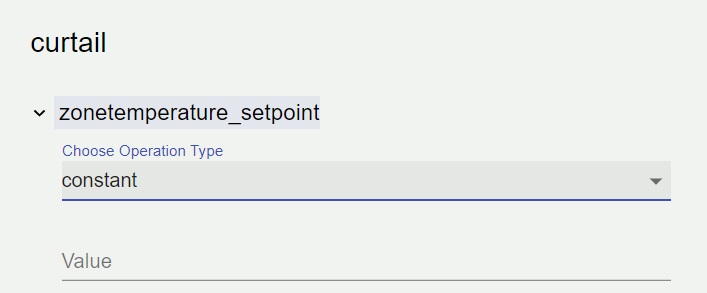
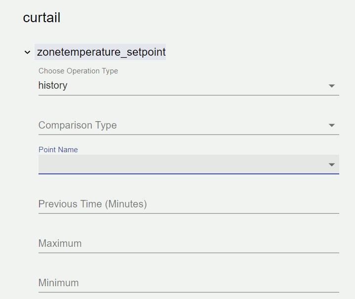

.. test documentation master file, created by
   sphinx-quickstart on Tue Jun 16 09:50:20 2020.
   You can adapt this file completely to your liking, but it should at least
   contain the root `toctree` directive.

.. contents:: Table of contents
    :depth: 3

.. toctree:: 
    :depth: 2

ILC Web application: User guide
*******************************

=================================
ILC APPLICATION CONFIGURATION
=================================

**!This doc is a test for creating a user guide. Edit this out when entire doc draft is finished.!**

The ILC application behavior is controlled through three
configuration files:
the main ILC configuration file,

1. the device/criteria configuration file, and
2. the criteria pairwise comparison configuration file.

The following sections describe what each configuration file
controls and the parameters defined within these configuration
files.

Importing master driver configuration store
===========================================

If you want to import a new master driver, in the top left corner of the screen you will see a hamburger drop down menu. 
once you click on that drop down you will see 2 things:

1. Save configuration file 
2. Import New Master driver Configuration file. 

if you click on the import new master driver configuration file, it will give you an option to import your
voltron application file. Once you do this, it will give you the option to choose from the uploaded settings. 

.. image:: ../source/pics/import_Master_driver.jpg
   :alt: Main Configuration File
   

ILC Main configuration File
===========================
First lets take a look at the main configuration file. There is an option right at the start that allows you to upload a file. This file that you upload will more than likeley be important to understanding your building number, etc. The nice thing about this application is it will be able to automatically read everything you upload, and give you major ease of access in order to understand your inputs. 

.. image:: ../source/pics/master_Driver.jpg
   :alt: Main Configuration File
  
 s

The ILC application behavior is controlled through three
configuration files:
- the main ILC configuration file,
- the device/criteria configuration file, and
- the criteria pairwise comparison configuration file.
The following sections describe what each configuration file
controls and the parameters defined within these configuration
files.

The main ILC configuration file contains building-level configuration
parameters. Figure 2 shows an example of an ILC main
configuration file.

The following list describes each of the configuration parameters in
the main ILC configuration file:

**campus**:
   The campus name as published by the VOLTTRON
   platform.driver service.
**building**: 
   The building name as published by the VOLTTRON
   platform.driver service.
**power_meter** : 
   Dictionary containing information to identify the
   power meter data published by the platform.driver.
   There will also be a drop down within the power meter setting: once you click that 
   drop down a few options, including a calculator will appear: 

**device** : 
   The device name for the building power meter as
   published by the platform.driver.
**point** : 
   The point name on the power meter for whole building
   power as published by the platform.driver.
**agent_id** : 
   The ILC instance (running application) name on the
   VOLTTRON platform.
**demand_limit** : 
   The ILC application manages devices (curtail) in
   an attempt to keep the average whole building power below this
   kilowatt value. The average time is determined by the average_
   building_power_window parameter.
**curtailment_time** : 
   The amount of time (minutes) the ILC
   application holds curtailment of devices once the building goal is
   met. During this period if the average WholeBuildingPower value
   increases above the goal the timer resets and the ILC application
   will attempt to curtail additional available devices. If all devices
   have been curtailed and the WholeBuildingPower is still above
   the goal the timer is not reset.
**curtailment_confirm**:
   Delay time (minutes) after curtailment
   actions to confirm that building demand goal has been met.
   If the building goal has not been met, additional curtailment
   action(s) will be taken if possible.
**curtailment_break**: 
   The time (minutes) after the completion
   of curtailment actions where no further curtailment actions
   are taken. Completion of curtailment actions happens
   after the curtailment_time timer elapses (i.e., the average
   WholeBuildingPower goals was met and maintained for
   the curtailment_time or all devices were curtailed and the
   curtailment_time timer elapsed).
**average_building_power_window** : 
   The average building
   power is calculated using a moving window. This parameter
   configures the length (minutes) of that window.
**clusters**: 
   Array of dictionaries containing information on each
   cluster of devices (a cluster consists of a group of devices with
   the same criterion):
**device_file_path** : 
   The full path to the device/criteria
   configuration file described in Section 3.2.
**criteria_file_path** : 
   The full path to the pairwise comparison
   configuration file described in Section 3.2.
**cluster_priority** : 
   Weighting factor assigned to this cluster.
   The sum of these weighting factors for all clusters should
   equal 1.0. If the sum of the cluster weighting factors is not
   1.0, the ILC application returns an error upon startup and
   shutdown. 
**mappers**: 
   A dictionary of dictionaries containing categorical
   assignment for use in the device/criteria configuration. This
   parameter is used for configuring the mapper criteria (Section
   3.2).

Towards the bottom of the screen in the main congfiguration file, you should also see 2 check mark boxes:

.. image:: ../source/pics/stagger_Release.jpg
   :alt: Main Configuration File
   :scale: 100

Adding A cluster
================
There are a list of items that you will see in the Main configuration of this application. Once you upload your file, there should be a drop down menu on each option you see. The options you should see are: 
Main configuration:

- Campus
- Building
- Power meter
   - devices
   - Point
   - demand formula (optional)
   - operational Argument
   - Calculator
- Agent ID
- Demand limit
- Control time(minutes)
- Curtailment Confirm
- Curtailment Break (minutes)
- Average Building Power Window (minutes)

**Clusters:**
On the left side of the screen under Device clusters, you should see an icon that says *+Add cluster*. when you click on this item, there is an entire new list of items that it lets you choose from on the right side:
- Cluster name 
- Cluster type
   - RTU
   - AHU
   - LIGHT
- Cluster priority

You have the option to insert anything into each of the options. With this, you can customize this cluster to your own liking. Once you click **Save New Cluster.**

.. image:: ../source/pics/Add_cluster.jpg
   :alt: Main Configuration File
   :scale: 50

.. image:: ../source/pics/cluster_type.jpg
   :alt: Main Configuration File
   :scale: 50

Customized Cluster options
++++++++++++++++++++++++++
**Clusters:**
On the left side of the screen under Device clusters, you should see an icon that says *+Add cluster*. when you click on this item, there is an entire new list of items that it lets you choose from on the right side:
- Cluster name 
- Cluster type
   - RTU
   - AHU
   - LIGHT
- Cluster priority

You have the option to insert anything into each of the options. With this, you can customize this cluster to your own liking. Once you click Save New Cluster.

in the *Device clusters* drop down on the left side of the screen, you should see a drop down that says your personalized cluster in a drop down. once you click on this cluster, there should be a new menu that is shown in the center of the screen once you click on that drop down. There are 5 default settings you can choose once you click the drop down for your personalized cluster. You can move them around and put them in any order you need. There is also a choice to add another cluster. The cluster should default be set like the list shown below: 

- zonetempature_setpoint
- setpoint
- history_zonetemperature
- rated_power
- roomtype
- **ADD CRITERIA**

This should be helpful for adding items into the list that do not appear, and being able to list them in the order that you prefer.

ILC Device/Criteria Configuration
=================================
The *ILC* application is used for management of peak demand for a
building. Different types of devices are grouped into *clusters* (e.g.,
heat pumps could be one cluster of devices while lighting fixtures
could be another). Each device within a cluster must have the same
criteria, but different clusters should have differing criteria because
the data points and operations of differing devices are not the
same (i.e., different criteria [conditions] need to be evaluated to
effectively determine different devices priority for curtailment).
The following conventions are used in this guide:

- The text colored red in the configuration file indicates a point on
the device. This point is published by the VOLTTRON platform.
driver service. In the example shown in Figure 3, a total of 5
points on the device are used in the platform driver.
- Text colored in green indicates the name of a criterion used for
prioritization of curtailable loads. In the example shown in Figure
3, a total of 5 criteria are used for prioritization of curtailable
loads in the platform driver.

The outer dictionary key must be the name of the device of interest
as published by the VOLTTRON platform.driver service (i.e., HP1
– colored in purple in Figure 3) and the value associated with this
key must be a point on the device. This point associated with the
device must be binary data that indicate the operational status of
the device. For this example, a heat pump in mechanical cooling mode 
is only available to shed load if the unit is mechanically 
cooling and this point (i.e., FirstStageCooling – colored in blue in
Figure 4) indicates a value of “ON” when cooling is active (True).
The inner dictionary (the value for the point FirstStageCooling)
contains the criteria configuration for the device (i.e., HP1) as well
as the curtail information (highlighted in grey in Figure 4). The
curtail information tells the ILC agent what point on the device to
command and the value to command that point to achieve the
desired load reduction for the device.

*ILC Device/Criteria Configuration* :
-------------------------------------

The ILC application is used for management of peak demand for a
building. Different types of devices are grouped into clusters (e.g.,
heat pumps could be one cluster of devices while lighting fixtures
could be another). Each device within a cluster must have the same
criteria, but different clusters should have differing criteria because
the data points and operations of differing devices are not the
same (i.e., different criteria [conditions] need to be evaluated to
effectively determine different devices priority for curtailment).

The AHP is multi-criteria decision-making process used by the ILC
application. The default criteria implemented for ILC of heat pumps
are explained in this section.
When you use the Criteria Configuration, you have the option to use items in the dropdown that were imported from your document that you uploaded at the start. This will be quite an array of options depending on what you have uploaded.

Once you click an option, you should see another drop down underneath *Curtail*. 
The dropdown should be listed as such: 

- zonetemperature_setpoint
- stage
- history_zonetemperature 
- rated_power 
- roomtype 

.. image:: ../source/pics/criteria_order.jpg
   :alt: Main Configuration File

ILC Criteria Configuration
--------------------------

Any number of relevant criteria can be used to prioritize loads for
curtailment to manage consumption (e.g., electricity or natural gas).
The ILC application supports five types of configurable criteria
which include the following:

- formula criterion
- status criterion
- mapper criterion
- constant criterion
- history criterion.

these options will be avaliable in the dropdown of whichever option you choose. 

The criteria type is controlled by setting the operation_type
parameter for each criterion. 

formula criteria
++++++++++++++++

.. image:: ../source/pics/formula.jpg
   :alt: Main Configuration File

The formula criterion allows a user to declare mathematical
formulas that are evaluated using current device measurements
(data from the device are published by the VOLTTRON platform.
driver service). The following list contains the formula criterion
configuration parameters:

- operation : String representation of a mathematical formula.
This mathematical formula is evaluated to return a numeric value.
- operation_args : List of point names from the device (HP1)
used to evaluate the mathematical formula in the operation
parameter. The values associated with each point are updated
when new device data are published by the platform.driver.
Table 1 lists the supported mathematical operators for the
formula criterion.

.. image:: ../source/pics/math_Table.jpg
   :alt: Main Configuration File
   

Figure 5 shows an example of a formula criterion configured for a
heat pump. The criterion name, zonetemperature-setpointdeviation,
should match the name for the same criterion used in
the pairwise comparison configuration file.

.. image:: ../source/pics/figure_5.jpg
   :alt: Main Configuration File
   

status criteria
+++++++++++++++

.. image:: ../source/pics/status.jpg
   :alt: Main Configuration File

   The status criterion reads a point (Boolean or enumeration) on the
device and returns either an on_value or an off_value depending
on whether the current status of the point is True (enumeration
value of 1) or False (enumeration value of 0), respectively. The
following list contains the status criterion configuration parameters:

• point_name – The point on the device (HP1) that is evaluated.
This device point should be a Boolean or an enumeration with a
value of 0 or 1.
• on_value – The numeric value returned by the criterion if the
point on the device indicates a True or enumeration value of 1.
• off_value – The numeric value returned by the criterion if the
point on the device indicates a False or enumeration value of 0.
Figure 6 shows an example of a status criterion configured for
a heat pump. The criterion name, rated-power, should match
the name for the same criterion used in the pairwise comparison
configuration file.

.. image:: ../source/pics/figure_6.jpg
   :alt: Main Configuration File
   

mapper criteria
+++++++++++++++

.. image:: ../source/pics/mapper.jpg
   :alt: Main Configuration File

The mapper criterion allows a user to categorize loads and assign
values to the categories. For example, room type can be used to
set the importance of the rooms (heating or cooling of the room
constitutes the load) for curtailment of power consumption. Rooms
assigned higher numerical values are regarded as less important
(more likely to be curtailed first) than rooms assigned lower numerical 
values. Users set their own priority depending on the
importance of the room (1: most important and 7: less important).
Table 2 shows an example of AHP priority based on room type.

   

The following list contains the mapper criterion configuration
parameters:
• dict_name – The dictionary name in the main ILC configuration
file that contains the key (category) and value assigned to that
category.
• map_key – The category assigned to the device.
Figure 7 shows an example of a mapper criterion configured for
a heat pump. The criterion name, room-type, should match the
name for the same criterion used in the pairwise comparison
configuration file.

   

constant criteria
+++++++++++++++++

   
The constant criterion returns a constant value for inclusion in the
AHP. The following list contains the status criterion configuration
parameters:
• value – The value returned by this criterion for inclusion in the
AHP.

Figure 8 shows a constant criterion example, configured for a heat
pump. The criterion name, stage, should match the name for the
same criterion used in the pairwise comparison configuration file.

.. image:: ../source/pics/figure_8.jpg
   :alt: Main Configuration File
   

history criteria
++++++++++++++++

   
The history criterion evaluates the rate of change of a point on the
device to return a numeric value. The following list contains the
history criterion configuration parameters:

• point_name – The point on the device (HP1) that is evaluated.
• comparison_type – This configuration parameter can be
configured to be direct or inverse. A direct comparison returns
the value of the point at the current time minus the value of the
point at some time in the past (configured as previous_time).
An inverse comparison returns unity divided by the value of the
point at the current time minus the value of the point at some
time in the past (configured as previous_time).
• previous_time – Time in minutes in the past to compare to
current value of the point on the device.
Figure 9 shows an example of a history criterion

Figure 9 shows an example of a history criterion configured for
a heat pump. The criterion name, historical-comparison,
should match the name for the same criterion used in the pairwise
comparison configuration file.

.. image:: ../source/pics/figure_9.jpg
   :alt: Main Configuration File
   

Pairwise configuration
======================
In the dropdown menu on the left, there will be an additional dropdown when you create your custom cluster.
The custom cluster will be listed with 3 additional items listed as such: 

.. image:: ../ILC_Tutorial_Screenshots/custom_Cluster.jpg
   :alt: Main Configuration File
   

At the top, you should see a criteria order. This will be completely customizable as well. You can click and drag 
each item in the order you prefer. There is also an additional option at the bottom to **+Add criteria** if you need
to add more. 

underneath the custom list, you should see a dropdown called: **Pairwise Criteria**. This will have various other customisation 
options as well. 

.. image:: ../source/pics/zonetemperature_Setpoint.jpg
   :alt: Main Configuration File

   
inside of each of the options, there should be a power mode you can set.
in a dropdown for each. 

.. image:: ../source/pics/zonetemperature_Setpoint.jpg
   :alt: Main Configuration File
.. image:: ../source/pics/stage.jpg
   :alt: Main Configuration File
.. image:: ../source/pics/history_Zonetemperature.jpg
   :alt: Main Configuration File
.. image:: ../source/pics/rated_Power.jpg
   :alt: Main Configuration File   

Conrol configuration: Empty add here
====================================

ILC Curtail Configuration Delete me
-----------------------------------

The curtail configuration parameters inform the ILC application
what point on the device to command and the value to command
that point to achieve the desired load reduction for the device.
Figure 10 shows the curtail configuration parameters for HP1.
The conditional_curtail parameters are optional (highlighted
in grey), but the curtail parameters are required (highlighted

.. image:: ../source/pics/figure_10.jpg
   :alt: Main Configuration File
   

in yellow).The curtail configuration information is essentially ifelse
logic embedded in the Java Script Object Notation (JSON)1
configuration file. The logic is executed as follows (Figure 11):

.. image:: ../source/pics/figure_11.jpg
   :alt: Main Configuration File
   

This allows the user to curtail the device differently based on
conditions evaluated at the time of curtailment. If a user does not
want to use conditional_curtail (this set of parameters is omitted)
or none of the conditionals evaluate to True, the curtail parameters
are used to curtail the device.

The following are required parameters for the conditional_curtail
parameter:

• condition – String representation of a mathematical conditional.
This mathematical conditional is evaluated to return a Boolean.
• conditional_args – List of point names from the device (HP1)
used to evaluate the mathematical formula in the operation
parameter. The values associated with each point are updated
when new device data are published by the VOLTTRON
platform.driver service.
• point – The point on the device (i.e., HP1) that is commanded to
achieve the load reduction.
• value – The value the point is commanded to, in order to achieve
the load reduction.
• offset – If offset parameter is present, then the value parameter
is ignored and the current value of the point on the device plus
the offset is commanded to the point on the device to achieve
the desired load reduction.
• load – The estimated load reduction for the curtail action.
The following are required parameters for the curtail parameter:
• point – The point on the device (i.e., HP1) that is commanded to
achieve the load reduction.
• value – The value the point is commanded to, in order to achieve
the load reduction.
• offset – If offset parameter is present, then the value parameter
is ignored and the current value of the point on the device plus
the offset is commanded to the point on the device to achieve
the desired load reduction.
• load – The estimated load reduction for the curtail action. This
parameter should be consistent with the measurement from the building 
power meter (i.e., if the building power is measured in
kilowatts then this value should also use kilowatts).

ILC Criteria Pairwise Comparison Configuration DELETE ME 

The ILC application uses the AHP to prioritize loads available for
curtailment. To implement the AHP the ILC application must be
provided the relative importance of each individual criterion with
respect to all other criteria (criteria that are used for that device/
criteria configuration). This information is configured in the criteria
pairwise comparison configuration file. Figure 12 shows an example
ILC criteria pairwise comparison configuration file:

.. image:: ../source/pics/figure_12.jpg
   :alt: Main Configuration File
   

The names for the criteria must match the names of the criteria used
in the device/criteria configuration file documented in Section 3.2.
Take the first entry in the configuration file as an example (Figure 13):

.. image:: ../source/pics/figure_13.jpg
   :alt: Main Configuration File
   

This tells the ILC application that the:
• zonetemperature-setpoint-deviation criterion is seven times
more important than the curtail_count criterion
• zonetemperature-setpoint-deviation criterion is five times more
important than the historical-comparison criterion
• zonetemperature-setpoint-deviation criterion is eight times more
important than the room-type criterion
• zonetemperature-setpoint-deviation criterion is six times more
important than the rated-power criterion
• zonetemperature-setpoint-deviation criterion is two times more
important than the pairwise comparison stage criterion
One may configure the criteria as less important too. Take the first
comparison as an example:
• “curtail_count”: 7
- The zonetemperature-setpoint-deviation criterion is seven times
more important than the curtail_count criterion
To configure the zonetemperature-setpoint-deviation criterion
as seven times less important than curtail_count criterion the
configuration file entry would be modified as follows:
• “curtail_count”: 0.1429
- The zonetemperature-setpoint-deviation criterion is seven times
less important than curtail_count criterion (note that 0.1429 is
1/7).

ILC provides an examination of consistency on criteria pairwise
comparison by measuring the Consistency Ratio (C.R).2
• If C.R ≤ 0.2: The pairwise comparison is consistent.
• If C.R > 0.2: The operation staff need to revise the pairwise
comparisons to meet the desired consistency. When C.R is
greater than 0.2, the ILC application provides the “inconsistent
pairwise comparison” error message.

ILC USE CASE: HEAT PUMP COOLING CONTROLS 'delete me 

// potentially not important. 

A demonstration project deployed the ILC application on heat
pumps during the 2016 summer cooling season. The following
section describes this use case.
The test described in this use case was conducted at PNNL
BUILDING8. PNNL BUILDING8 is a single-story building consisting
of office spaces and a large shop for operations and maintenance
work. Information for PNNL BUILDING8 is summarized in Table 3:

.. image:: ../source/pics/table_3.jpg
   :alt: Main Configuration File
   

Heating and cooling at PNNL BUILDING8 is accomplished by 10
heat pumps that serve the building. The specifications for the
heat pumps in PNNL BUILDING8 are given in Table 4. Three heat
pumps, named 1A, 1B, and 2, have one refrigerant circuit with a
nominal cooling capacity of 3 tons and electric heater capacity of
7.5 kW. Three heat pumps, named HP3, HP4, and HP7, each has
two compressors with a nominal cooling capacity of 7.5 tons and
electric heater capacity of 14 kW. Two heat pumps, named HP6
and HP8, have a nominal cooling capacity of 25 tons each. HP6
has electric heater capacity of 72 kW, and HP8 has electric heater
capacity of 54 kW. Both HP6 and HP8 use two refrigerant circuits
that have two compressors and two condenser fans. Two heat
pumps named HP5 and HP14 have a nominal capacity of 4 tons and
electric heater capacity of 13 kW, and 3 tons without an electric
heater.
Each heat pump has its own advanced building automation
system (BAS) controller and is configured to provide discrete
command signals to the heat pump for staging of the indoor fan,
compressors, auxiliary heat and economizer.

.. image:: ../source/pics/table_4.jpg
   :alt: Main Configuration File
   

Each of these heat pumps has the following points (Table 5) that are
trended by a dedicated VOLTTRON node at 1-minute intervals.

.. image:: ../source/pics/table_5.jpg
   :alt: Main Configuration File
   

ILC Use Case: Heat Pump Cooling Control DELETE ME

The goal of the ILC application is to intelligently limit peak demand
within a building, thereby eliminating or reducing demand charges
from local electric utilities. To achieve this peak reduction, the
ILC application must be configured with a building demand
goal. ILC will work to keep the actual average whole building
power at or below this value. Knowledge of the utility demand
charge rate structure and/or use of forecasting tools (Whole
Building Electricity Diagnostician3) can be used to determine
an appropriate building goal. The target peak demand can vary
hourly, daily, monthly, or seasonally. For efficient operation of ILC,
it is necessary to accurately model the expected behavior of the
curtailable loads. The target peak demand level can be adjusted
using the forecasting tools. Figure 14 shows the load prediction for
PNNL BUILDING8 on July 11, 2016. The demand goal for this test
was chosen to be 90% of the maximum predicted load (i.e., the
maximum predicted load was 150 kW and the goal was 90% of this
value – 135 kW).

.. image:: ../source/pics/figure_14.jpg
   :alt: Main Configuration File
   

Once a demand goal has been determined the ILC main
configuration file can be updated. The example ILC configuration
file provided with the ILC source code on GitHub4 contains all the
required parameters; one must only update the values associated
with each entry to customize the ILC application. Figure 15 shows
the configuration file used for the ILC test at PNNL BUILDING8.

.. image:: ../source/pics/figure_15.jpg
   :alt: Main Configuration File
   

The following list describes each parameter and the significance of
the value configured for that parameter:

*campus* : The campus name as published by the VOLTTRON
platform.driver.

*The VOLTTRON platform.driver service*: publishes data for the
PNNL campus. If the VOLTTON driver does not publish device
data with a campus specified, this parameter should be left
blank (with empty quotes).

*building* : The building name as published by the VOLTTRON
platform.driver.

*The VOLTTRON platform.driver*: service publishes data for
the building named BUILDING8 on the PNNL campus. If the
VOLTTON driver does not publish device data with a building
specified, this parameter should be left blank (with empty
quotes).

*power_meter* : Dictionary containing information to identify the
power meter data published by the platform.driver.

*device* : The device name for building power meter as published
by the platform.driver.

*The VOLTTRON platform.driver*: service publishes data for the
device named METERS in BUILDING8 on the PNNL campus.
This parameter must be specified. The format for topic
published by the VOLTTRON platform.driver associated with
these data is : PNNL/BUILDING8/METERS.

*point* : The point name on the power meter for whole building
power as published by the platform.driver.

*The VOLTTRON platform.driver* : service publishes data for the
device named METERS in BUILDING8 on the PNNL campus.
This device has a data point called WholeBuildingPower. This
parameter must be specified.

*agent_id* : The ILC instance (running application) name on the
VOLTTRON platform.

*demand_limit* : The ILC application manages devices (curtail) in
an attempt to keep the average whole building power below this
kilowatt value.

Knowledge of the utility demand charge rate structure and/or
use of forecasting tools can be used to determine this value for
a building.

*curtailment_time* : The amount of time (minutes) the ILC
application will hold curtailment of devices once the building
goal is met. If during this period the average value for the
WholeBuildingPower increases above the goal, the timer
resets and the ILC application attempts to curtail additional
available devices. If all devices have been curtailed and the
WholeBuildingPower is still above the goal, the timer is not reset.

The ILC application holds all devices curtailed for 20 minutes
after the average WholeBuildingPower falls below (and remains
below) the demand_limit.

*curtailment_confirm* : Delay time (minutes) after curtailment
actions to confirm that the building demand goal has been met.
If the building goal has not been met, additional curtailment
action is taken if possible.

The ILC application waits 5 minutes after curtailment actions
to verify whether the curtailment actions achieved the desired
load reduction (reduced the average building power below
the demand_limit). If the desired load reduction is not
attained, the ILC application takes further curtailment actions (if
additional devices are available for curtailment).

*curtailment_break* : The time (minutes) after the completion
of curtailment actions during which no further curtailment
actions are taken. Completion of curtailment actions happens
after the curtailment_time timer elapses (i.e., the average
WholeBuildingPower goals are met and maintained for
the curtailment_time or all devices are curtailed and the
curtailment_time timer elapsed).

*average_building_power_window* : The average building
power is calculated using a moving window. This parameter
controls the length (minutes) of that window.

Utility demand charges are typically based on a 15- or
30-minute average power reading.

*clusters* : Array of dictionaries containing information about
each cluster of devices (a cluster consists of a group of devices
with the same criterion):

*device_file_path* : Full path to the device/criteria configuration
file described in Section 3.2.

*criteria_file_path* : Full path to the pairwise comparison
configuration file described in Section 3.2.

*cluster_priority* : Weighting factor assigned to this cluster. The
sum of these weighting factors for all clusters should equal 1.0.

For one device cluster (heat pumps) this value should be set
to 1.0.

*mappers* : A sub-dictionary of dictionaries containing
categorical assignment for use in the device/criteria
configuration. This parameter is used for configuring the mapper
criteria (Section 3.2).

This allows categorical assignment. The zone type served
by each heat pump can be specified as well as a numerical
(importance of the category decreases as the value increases
numerically) indication of the importance of that category.
For example, for our use case a Director’s Office is the most
important category, while a Mechanical Room and Lobby are
the least important categories. When a heat pump serves more
than one zone, the most important zone type served is used for
categorical assignment.

ILC Criteria Configuration
==========================
The AHP is multi-criteria decision-making process used by the ILC
application. The default criteria implemented for ILC of heat pumps
are explained in this section.

1. Heat pump power (rated-power): Heat pump power
measurement is generally a fixed (static) data value that is taken
36
from the heat pump nameplate data because the likelihood of
obtaining individual power measurements per heat pump is
limited in real-life applications.

2. Curtailment count for heat pump compressor (curtail_count
- ncurt): The maximum number of heat pump compressor
curtailments (ncurt) represents the total number of heat pump
compressor curtailments allowed during a fixed time period (24-
hour period). The ncurt provides the information about how each
heat pump is used. Heat pumps that approach their maximum
number of compressor curtailments in the fixed time period
(adjustable) are pushed to the low end of the priority table for
available loads in the AHP.

3. Change of zone temperature (historical-comparison -
ΔTzone_δ): Zone temperature changes represent the temperature
condition of the zones served by heat pumps. A zone
temperature that has large changes (ΔTzone_δ) indicates an
excessive cooling (heating) capacity for a specific time period.
ΔTzone_δ can be calculated as shown in Equation 1 for the cooling
mode and Equation 2 for the heating mode. When ΔTzone_δ is less
than or equal to zero, the cooling or heating load requirement
does not exist (e.g., heat pump compressor turns off) and the
ΔTzone_δ is set to zero. Significant changes in zone temperature
may indicate internal or external loads (solar gain, perimeter
zones with poor envelope or high infiltration loads, conference
rooms with high occupant densities, etc.).

.. image:: ../source/pics/cooling_heating_mode.jpg
   :alt: Main Configuration File
   

4. Temperature difference between zone and set point
(zonetemperature-setpoint-deviation - ΔTzone-csp or ΔTzonehsp
): The temperature difference between zone and set point
(ΔTzone-csp or ΔTzone-hsp) may reflect the occupant’s comfort status in
the zone corresponding to each heat pump. The measurement is
real-time data. The input of the AHP is the inverse value of ΔTzonecsp
and ΔTzone-hsp as shown in Equation 3 for cooling mode and
Equation 4 for the heating mode. When the value between Tzone
and Tcsp (or Thsp) is higher than or equal to 0.1, ΔTzone-csp (ΔTzone-hsp)
should be determined to be 10.

.. image:: ../source/pics/cooling_heating_mode2.jpg
   :alt: Main Configuration File
   

5. Heat pump room type (room-type): Heat pump room type
provides the means to prioritize each heat pump. The room
with the higher assigned numerical value is regarded as less
important than rooms with lower numerical values. In the ILC
configuration, the building operations staff could set their own
heat pump prioritization strategy depending on the importance
of room types served (1: Most importance and 9: Least
importance). Table 6 shows the heat pump priority based on
room type for PNNL BUILDING8:

.. image:: ../source/pics/table_6.jpg
   :alt: Main Configuration File
   

6. Heat pump stages (stage): Second stage cooling results in peak
power consumption but for shorter operating periods, whereas
first stage cooling operates longer with a lower peak power.
Second stage heating (electric) also leads to higher peak power
consumption with shorter operating periods than first stage
heating (heat pump).

For advanced heat pump controllers, the ILC application
attempts to turn off the second stage for load curtailment. The
stage prioritization can be determined by assigning numerical
values to FirstStageCooling and to SecondStageCooling (for
cooling) and to FirstStageHeating and to SecondStageHeating
(for heating) as shown in Table 7.

.. image:: ../source/pics/table_7.jpg
   :alt: Main Configuration File
   

ILC Criteria Pairwise Comparison Configuration
==============================================

The ILC application uses the AHP to prioritize loads available for
curtailment. To implement the AHP the ILC application must be
provided the relative importance of each criterion with respect
to all other criteria (criteria that are used for the device/criteria
configuration). This information is configured in the criteria pairwise
comparison configuration file. Figure 16 shows the criteria pairwise
comparison file used for deployment of ILC in PNNL BUILDING8:

.. image:: ../source/pics/figure_16.jpg
   :alt: Main Configuration File
   

.. image:: ../source/pics/figure_17.jpg
   :alt: Main Configuration File
   

Take the first entry in the configuration file (Figure 13):
This tells the ILC application that the:

• zonetemperature-setpoint-deviation criterion is seven
times more important than curtail_count criterion

• zonetemperature-setpoint-deviation criterion is five
times more important than historical-comparison criterion

• zonetemperature-setpoint-deviation criterion is eight
times more important than room-type criterion

• zonetemperature-setpoint-deviation criterion is six times
more important than rated-power criterion

• zonetemperature-setpoint-deviation criterion is two
times more important than stage criterion.

One may configure the criteria as being less important too. Take
the first comparison as an example:

• “curtail_count”: 7
- The zonetemperature-setpoint-deviation criterion
is seven times more important than the curtail_count
criterion.

To configure the zonetemperature-setpoint-deviation
criterion as seven time less important than curtail_count
criterion the configuration file entry would be modified as follows:

• “curtail_count”: 0.1429
- The zonetemperature-setpoint-deviation criterion is
seven times less important than curtail_count criterion
(note that 0.1429 is 1/7).
Take the second entry in the configuration file (Figure 18):

.. image:: ../source/pics/figure_18.jpg
   :alt: Main Configuration File
   

This tells the ILC application that the:

• stage criterion is five times more important than the curtail_
count criterion

• stage criterion is three times more important than the
historical-comparison criterion

• stage criterion is six times more important than the room-type
criterion

• stage criterion is four times more important than the ratedpower
criterion.

.. image:: ../source/pics/figure_19.jpg
   :alt: Main Configuration File
   

Take the third entry in the configuration file (Figure 19); it tells the
ILC application that the:

• historical-comparison criterion is three times more
important than the curtail_count criterion

• historical-comparison criterion is five times more important
than room-type criterion

• historical-comparison criterion is three times more
important than rated-power criterion/
Take the fourth entry in the configuration file (Figure 20):

.. image:: ../source/pics/figure_20.jpg
   :alt: Main Configuration File
   

This tells the ILC application that the:

• curtail_count criterion is three times more important than
the room-type criterion

• curtail_count criterion is five times more important than the
rated-power criterion
Take the fifth entry in the configuration file (Figure 21):

.. image:: ../source/pics/figure_21.jpg
   :alt: Main Configuration File
   

This tells the ILC application that the:

• rated-power criterion is three times more important than the
room-type criterion

Take the sixth entry in the configuration file (Figure 22):

.. image:: ../source/pics/figure_22.jpg
   :alt: Main Configuration File
   

This tells the ILC application:
• The relative importance of the room-type criterion with respect
to all other criteria has already been specified in the previous
criteria configuration.
• The parameter (with empty value) must be specified for the ILC
application to use the criteria.

ILC Device/ Criteria Configuration for Heat Pumps during Cooling Operations DELETE ME

Heating and cooling in PNNL BUILDING8 is achieved by 10 heat
pumps. Five of these heat pumps have two stages of cooling (i.e.,
two compressors that are staged on and off based on the cooling
demand). Figure 23 shows the device/criteria configuration entry
for HP3 at PNNL BUILDING8. This heat pump serves a lobby and
lunch room space (thus the room-type/map_key = Lobby). The
device/criteria configuration was covered in detail in Section 3.2.
The following information is useful in understanding the ILC test at
PNNL BUILDING8:

.. image:: ../source/pics/figure_23_pt1.jpg
   :alt: Main Configuration File
   

.. image:: ../source/pics/figure_23_pt2.jpg
   :alt: Main Configuration File
   

• The criteria for FirstStageCooling and
SecondStageCooling are identical except for the stage
criteria. The stage criterion value for SecondStageCooling
is three times greater than the stage criterion value
for FirstStageCooling. This ensures that if both
FirstStageCooling and SecondStageCooling are “ON”
then SecondStageCooling will always be curtailed before
FirstStageCooling.

• The conditional_curtail and curtail entries in the file control
how the ILC application interacts with the heat pump.

The curtail configuration parameters inform the ILC application
what point on the device to command and the value to command
that point to achieve the desired load reduction for the device.
Figure 24 shows the curtail configuration parameters for HP3. The
conditional_curtail parameters are optional (highlighted in grey),
but the curtail parameters are required (highlighted in yellow).

.. image:: ../source/pics/figure_24.jpg
   :alt: Main Configuration File
   

The curtail configuration information is essentially if-else logic
embedded in the JSON configuration file. The logic is executed as
follows (Figure 25):

.. image:: ../source/pics/figure_25.jpg
   :alt: Main Configuration File
   

This allows the user to curtail the device differently based on
conditions evaluated at the time of curtailment. If a user does not
want to use conditional_curtail (this set of parameters is omitted)
or none of the conditionals evaluate to True, the curtail parameters
is used to curtail the device.
The following are required parameters for a conditional_curtail:

• condition – String representation of a mathematical conditional.
This mathematical conditional is evaluated to return a Boolean.
- The above configuration informs the ILC application to evaluate
the point OccupancyMode on HP3.

• conditional_args – List of point names from the device (HP3)
used to evaluate the mathematical formula in the operation
parameter. The values associated with each point are updated
when new device data are published by the platform.driver.

• point – The point on the device (i.e., HP1) commanded to
achieve the load reduction.

• value – The value the point is commanded to, in order to achieve
the load reduction.

• offset – If offset parameter is present then the value parameter
is ignored and the current value of the point on the device plus
the offset is commanded to the point on the device to achieve
the desired load reduction.

• load – The estimated load reduction for the curtail action.

The above configuration tells the ILC application to evaluate the
point OccupancyMode associated with HP3 (published by the
VOLTTRON platform.driver). If OccupancyMode evaluates to
True (the zone served by HP3 is in an occupied mode), then the
ILC application modifies the CoolingTemperatureSetPoint.
The ILC application adds the offset to the current value of the
CoolingTemperatureSetPoint and then commands the
CoolingTemperatureSetPoint to this new value.
If the OccupancyMode point associated with HP3 is evaluated
to False, then the ILC application uses the curtail configuration
(i.e., executes curtail as “else” contingency) parameter. The
ILC application adds the offset to the current value of the
UnoccupiedCoolingTemperatureSetPoint and then
commands the UnoccupiedCoolingTemperatureSetPoint to
this new value.
The offset parameter can be positive or negative. During cooling
the offset is positive; during ILC actions the temperature set point

for the zone served by the heat pump is increased and the zone
becomes warmer prior to HP3 engaging mechanical cooling,
thereby reducing power consumption by the heat pump. During
heating the offset is configured as a negative value (i.e., the zone
becomes cooler prior to the heat pump engaging mechanical
heating). The set point affects occupant comfort. Unoccupied or
low-occupancy zones can often have more aggressive modifications
to set points because occupant comfort is not a significant issue.
Upon completion of curtailment actions, the ILC application returns
all devices to normal operations. The ILC application makes use of
the VOLTTRON platform Actuator agent, which supports reversion
to normal operations after control actions by an application.
Currently, the ILC application releases all curtailed devices
simultaneously, but a stagger release algorithm is in testing to
alleviate the potential rebound effect caused by returning devices
to normal operations.

5.1 ILC Use Case: VAV Boxes and Lighting Control DELETE ME

As discussed in the use case for heat pump cooling control, the
main ILC configuration file contains building-level configuration
parameters. Figure 27 shows an example of an ILC main
configuration file for managing VAV boxes and dimmable lighting
systems. By implementing a combination of dimmable lighting and
VAV boxes, ILC can manage load curtailment reductions from both
VAV boxes and dimmable lighting systems to achieve a greater
load reduction than either system (VAV boxes or dimmable lighting
systems) could independently achieve on their own. For a detailed
description of the main ILC configuration file, see Section 3.1.

The following list describes each of the configuration parameters in
the main ILC configuration file:

• campus – The campus name as published by the VOLTTRON
platform.driver service.
• building – The building name as published by the VOLTTRON
platform.driver service.
• power_meter – Dictionary containing information to identify the
power meter data published by the platform.driver.
- device – The device name for the building power meter as
published by the platform.driver.
- point – The point name on the power meter for whole
building power as published by the platform.driver.
• agent_id – The ILC instance (running application) name on the
VOLTTRON platform.
• demand_limit – The ILC application manages devices (curtail) in
an attempt to keep the average whole building power below this
kilowatt value. The average time is determined by the average_
building_power_window parameter.
• curtailment_time – The amount of time (minutes) the ILC
application holds curtailment of devices once the building goal
is met. If during this period the average WholeBuildingPower
increases above the goal the timer resets and the ILC application
attempts to curtail additional available devices. If all devices
have been curtailed and the WholeBuildingPower is still above
the goal the timer is not reset.
• curtailment_confirm – Delay time (minutes) after curtailment
actions to confirm that building demand goal has been met.
If the building goal has not been met, additional curtailment
action(s) are taken, if possible.
• curtailment_break – The time (minutes) after the completion
of curtailment actions during which no further curtailment
actions are taken. Completion of curtailment actions happens
after the curtailment_time timer elapses (i.e., the average
WholeBuildingPower goals were met and maintained for
the curtailment_time or all devices were curtailed and the
curtailment_time timer elapsed).
• average_building_power_window – The average building
power is calculated using a moving window. This parameter
configures the length (minutes) of that window.
• clusters – Array of dictionaries containing information about
each cluster of devices (a cluster consists of a group of devices
with the same criterion):
- device_file_path – Full path to the device/criteria configuration
file described in Section 3.2.
- criteria_file_path – Full path to the pairwise comparison
configuration file described in Section 3.2.
- cluster_priority – Weighting factor assigned to this cluster.
The sum of these weighting factors for all clusters should equal
1.0. If the sum of the cluster weighting factors is not 1.0 the ILC
application returns an error upon startup and shutdown.
• mappers – A dictionary of dictionaries containing categorical
assignment for use in the device/criteria configuration. This
parameter is used for configuring the mapper criteria (Section
3.2).

Users configure the weighting factor (“cluster_priority”) that
is applied to the raw score of the equipment in one (or more)
cluster. When more than one cluster exists, the sum of all the
cluster priorities should equal 1.0 (See Figure 27 for example). In
this example, a weighting factor of 0.33 is applied to the lighting
cluster. All devices in this cluster are previously assigned a raw
score and the weighting factor is multiplied to provide a final
number. This same approach is true for the VAV box devices (a
weighting factor of 0.67 is applied to the VAV devices in the VAV
cluster). This results in each device with its own score. That score
determines the device priority in the array of loads that could be
curtailed during an ILC event.

.. image:: ../source/pics/figure_27.jpg
   :alt: Main Configuration File
   

5.2 ILC Criteria Configuration Delete me

The criteria implemented for ILC configuration of VAV boxes
and lighting systems are explained in this section. For a detailed
description of each of ILC criterion, see Section 3.2.1. Only new
criteria are described in this section.

5.3 ILC Criteria Pairwise Comparison Configuration DELETE ME

The AHP is multi-criteria decision-making process used by the ILC
application and applied to different loads. In this case, we apply the
AHP to VAV box loads with the following descriptions:

1. Terminal box damper position (TerminalBox-Damper-
Position): The VAV terminal box damper is designed to control
the air flow into a zone. In a typical VAV box configuration (with
a modulating damper and damper actuator arrangement), the
zone temperature is continuously compared to the zone cooling
setpoint. As the zone temperature rises above the zone cooling
setpoint, the VAV box calculates a higher airflow setpoint that
results in the VAV box damper command increasing in value
to meet the newly calculated airflow setpoint. This new airflow
setpoint causes the damper actuator to open further (from the
minimum position up to 100% or as required) in order to attain
the new airflow setpoint. In the cooling mode, the damper
actuator opens the VAV box damper in response to zone
temperatures that are above the zone cooling setpoint that
cause the calculated airflow setpoint to also increase (increase
flow of cool air to bring the zone temperature back to setpoint).
Once the zone temperature drops below the zone cooling
set point, the VAV box calculates a lower airflow setpoint and
this causes the VAV damper to modulate to a lower value to
reduce the airflow rates. Therefore, the VAV damper position
has an impact on the thermal comfort conditions and indoor
environmental quality. Ultimately, the VAV damper position
directly correlates to the AHU fan power loading as the AHU tries
to maintain the static pressure needed to achieve the desired
VAV box airflow rates that are a result of the zone temperature
deviation from the zone cooling setpoint.

Note: A VAV terminal box configured with minimum airflow rate
values that are 50% or more of the maximum airflow rate values
may affect the level of success for VAV zone cooling setpoint
adjustments.

.. image:: ../source/pics/figure_28.jpg
   :alt: Main Configuration File
   

2. Lighting level (lightng_levels): The lighting levels can
have an impact on the productivity, safety, and security of
building occupants. Therefore, the lighting power capacity
for selected areas should not be reduced to levels that could
possibly affect the visual comfort, safety, and security of the
occupants in the zone. When selecting which lights should
be dimmed, the current light levels and how low they can be
further reduced should be evaluated to mitigate negative
impacts on the occupants. Dimming of lighting circuits as an ILC
strategy is limited by the physical configuration of the lighting
circuits and the dimming control capabilities that may or may
not exist (dimmable ballasts versus non-dimmable ballasts). In
addition, daylighting sensors, occupancy sensors, and other BAS
strategies may already be optimizing lighting systems.

.. image:: ../source/pics/figure_29.jpg
   :alt: Main Configuration File
   

5.4 ILC Device/Criteria Configuration for VAV Boxes and Lighting Delete me

The default criteria implemented for ILC of VAV boxes are
explained in Figure 30. For a detailed description of ILC device/
criteria configuration, see Section 3.2. Only new criteria are listed
and described in this section.

• VAV terminal box 102, served by AHU1 (“AHU1/VAV102”):
Identify an equipment name for participating in ILC events.

• Occupancy mode (“OccupancyMode”): Identify a status point
for checking the equipment status before executing ILC. For
example, if the occupancy mode is “0”, the ILC application
excludes the equipment from participating in ILC events.

• Cooling temperature setpoint offset (“offset”): Specify a value
(in °F) for increasing the zone cooling temperature setpoint.
ILC can effect a reduction of power as a result of zone cooling
temperature setpoint changes. For example, if the zone cooling
temperature setpoint is 74°F while an ILC event occurs, the ILC
application will increase the zone cooling temperature setpoint
from 74°F to 75°F (or higher). Increasing the zone cooling
temperature setpoint can result in the reduction of conditioned
air flowing to the space through the VAV terminal box. It may
also reduce the chilled water flow requirements through the AHU
cooling coil, serving the VAV terminal box.

• Expected power demand reduction from VAV box (“load”):
Specify a value for the expected power demand reduction (in
kW) as a result of ILC actions. It may be difficult to calculate the
expected power demand reduction from reduced airflow at a
VAV box without actual field experiments or the use of building
and energy simulation models to estimate the power demand
reduction value(s). The user may need to experiment with
different levels of zone cooling temperature setpoint increases
to determine the optimum level of increase that also provides a
commensurate power demand reduction value.

.. image:: ../source/source/ILC_Tutorial_Screenshots/figure_30.jpg
   :alt: Main Configuration File
   

The default criteria implemented for ILC of lighting are explained in
Figure 31.

• Lighting in Room 102 (“AHU1/Light102”): Identify an equipment
name for participating in ILC events.

• Light mode (“LightMode”): Identify a status point for checking
the equipment status before executing ILC. For example, if the
light mode is “0”, the ILC application excludes the equipment
from participating in ILC events (because the light fixture/circuit
is assumed to already be off).

• The relative lighting level (“offset”): Specify a value, (in % output
as a number) for decreasing the relative lighting level output. For
example, reduce the lighting level output signal 30% below the
current lighting level output signal while an ILC event occurs.

• Expected power demand reduction from lighting control
(“load”): Specify a value for the expected power demand
reduction (in kW) as a result of ILC actions that come from
reduced lighting level output commands. For example, the
reduction in demand can be calculated by multiplying the
number of lamps that can reduced (dimmed) by their wattage
rating.

.. image:: ../source/pics/figure_31.jpg
   :alt: Main Configuration File
   

Indices and tables
==================

* :ref:`genindex`
* :ref:`modindex`
* :ref:`search`

      

